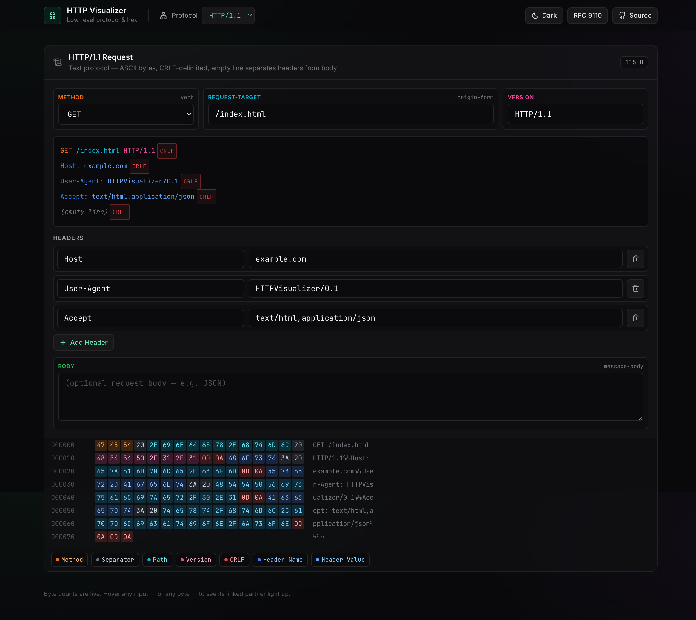

# HTTP Visualizer

An interactive, single-page web app that demystifies **HTTP/1.1**, **HTTP/2**, and **HTTP/3** by letting you construct a request visually and watch the **byte-for-byte hex dump** update live as you type.

Hover any input — the corresponding bytes light up.
Hover any byte — the input it came from lights up.
Every `\r\n`, every HPACK static-table index, every QUIC varint is labeled and color-coded.

**[Live demo →](https://yotamlevit.github.io/HTTPVisualizer/)**



## Why this exists

Reading the HTTP specs (RFC 7230, RFC 7540, RFC 9114, RFC 7541) is one way to learn them. Actually seeing the bytes change as you flip `END_STREAM` or compress `:method GET` into a single `0x82` is another. This tool is the second way.

It's aimed at:

- Engineers who know HTTP at the semantic level (methods, headers, bodies) but have never looked at the wire bytes.
- Students of networking who want a concrete feel for what HPACK, QPACK, QUIC varints, and H2 framing actually do.
- Anyone debugging a protocol conformance issue who wants a reference they can poke at.

## Features

- **Three protocols, one UI.** Switch between HTTP/1.1, HTTP/2, and HTTP/3 from the top bar; each mode preserves its own state.
- **Live hex dumps.** Typing a character recomputes the hex in under 10 ms (measured p95 in Chrome).
- **Bidirectional hover linking.** A stable `elementId` tied to each input is also emitted as a `ByteRange` by the generator, so hovering either side highlights the other.
- **Nested ranges.** An H2 `:method GET` highlights as a whole field on the editor side, but its individual HPACK sub-parts (prefix byte, name length, value literal, etc.) highlight individually when you hover the hex.
- **Color-coded concepts.** Frame headers in yellow/amber, pseudo-headers purple, standard headers blue, body green, CRLF red, HTTP/1.1 method/path/version orange/cyan/pink — applied identically to bytes and inputs.
- **Explicit `[CRLF]` badges.** HTTP/1.1's invisible delimiters are rendered as actual visual pills in both the plaintext preview and the hex dump, including the mandatory empty-line separator between headers and body.
- **Dark & light themes.** Toggleable, persisted to `localStorage`, with an inline pre-hydration script to avoid flash of wrong color.
- **Live byte counter** on every card.

## Getting started

### Requirements

- Node.js 20 or newer
- npm (or a compatible package manager)

### Install and run

```bash
npm install
npm run dev
```

Open [http://localhost:5173/](http://localhost:5173/).

### Other scripts

| Script | What it does |
|---|---|
| `npm run dev` | Vite dev server at `http://localhost:5173/` with hot-reload |
| `npm run build` | `tsc -b` type-check + `vite build` → production bundle in `dist/` |
| `npm run preview` | Serve the built bundle locally |
| `npx tsx scripts/validate.mjs` | Run 31 headless byte-level assertions against the pure generators |

> There is no test runner, no ESLint config, and no CI configured. The `"lint"` script references `eslint` but the package is not installed — install ESLint first if you want it.

## How it works

### The `elementId` / `ByteRange` contract (the core idea)

Everything in the app hangs off one invariant:

> **Each UI input and each emitted byte share a string `elementId`.**

- `src/types/protocol.ts` defines `ByteRange { start, end, elementId, concept, label }`. Every generator emits a `HexDump { bytes: Uint8Array, ranges: ByteRange[] }`.
- `src/store/useProtocolStore.ts` holds a single `hoveredElementId`. Inputs (via `LinkedField` / `HeadersEditor`) and bytes (via `HexDump`) both write to it on mouse enter and read from it to decide whether to highlight.
- `src/components/HexDump.tsx` precomputes, per byte offset, the *innermost* range that byte belongs to. That range drives its color, tooltip, and hover target.

When adding a new field anywhere, you must:

1. Give it a unique `elementId` (convention: dotted path — `h2.pseudo.method`, `h1.header.<row-id>.value`, etc.).
2. Have the generator emit a `ByteRange` with that exact id and a `ConceptKind`.
3. Wrap the input in `LinkedField` (or `HeadersEditor` for dynamic rows) with the same `elementId`.

If ids don't match, bytes still render but hover-linking silently breaks.

### The `HexBuilder` pattern

Generators are pure TypeScript, live in `src/lib/`, and share a small `HexBuilder` utility:

- `.push(bytes, { elementId, concept, label })` — append bytes and register a range at the same time.
- `.patch(offset, bytes)` — rewrite bytes at a previously reserved offset. Used for **length back-patching** in HTTP/2 and HTTP/3: reserve the length field, write the payload, then overwrite the reserved slot with the actual payload length.

Deliberate choice: generators never pre-compute lengths. They reserve, then back-patch. This mirrors how a real server writes frames and avoids a class of bugs.

### Protocol-specific notes

**HTTP/1.1 (`src/lib/http1.ts`)**

Every `\r\n` is emitted as its own `ByteRange` with concept `"crlf"` so the UI can badge them. The empty CRLF that separates headers from body is explicit — not an accident of `"\r\n".repeat(n)` somewhere.

**HTTP/2 (`src/lib/http2.ts`)**

`appendFrame()` writes the 9-byte frame header:

```
Length (24)  | Type (8) | Flags (8) | R (1) | Stream ID (31) | Payload...
```

The 3-byte length is reserved, the payload is written, then `HexBuilder.patch()` rewrites the length. Flags `END_HEADERS (0x4)` and `END_STREAM (0x1)` are toggleable from the UI and propagate to the flags byte.

The app splits the HEADERS block into two frames (pseudo-headers + standard headers) as a **pedagogical** choice — the spec supports this via CONTINUATION. A real client typically sends a single HEADERS frame followed by CONTINUATION as needed.

**HTTP/3 (`src/lib/http3.ts`)**

`appendH3Frame()` uses `quicVarint()` for both the frame Type and Length fields. Unlike H2's fixed 9-byte header, H3 frames are `{ varint Type | varint Length | Payload }` — with no Stream ID (that's at the QUIC layer, one level below) and no flags.

The length field reserves a 2-byte varint slot and back-patches. Payloads needing 4- or 8-byte varint lengths are clamped with a code comment; for interactive inputs in the UI this limit isn't reachable.

Each HEADERS payload is prefixed with `0x00 0x00` — the QPACK header block prefix (Required Insert Count = 0, Base = 0).

**HPACK / QPACK (`src/lib/hpack.ts`)**

A **small, non-conformant, pedagogical** HPACK simulator. Its role is to make the three representative encoding forms visible:

1. **Indexed Header Field** — when name and value both match the static table, emit a single byte with the 7-bit index and MSB set.
   - `:method GET` → `0x82` (static index 2, `0x80 | 2`)
   - `:scheme https` → `0x87`
   - `:path /index.html` → `0x85`
2. **Literal with indexed name** — when only the name matches, emit `0x40 | idx` + value length + UTF-8 value.
   - `:authority example.com` → `0x41 0x0B 65 78 61 6D 70 6C 65 2E 63 6F 6D`
3. **Literal with new name** — when nothing matches, emit `0x40` + name length + name + value length + value.

No Huffman coding. No dynamic table. The integer-encoding extension (RFC 7541 §5.1) **is** implemented, so names or values longer than 127 bytes produce multi-byte lengths correctly.

The same module backs the QPACK simulation in HTTP/3 — because at the teaching level the shapes are the same, and keeping one module keeps the bytes consistent across modes.

### Concept color palette (do not diverge)

Color is part of the product. Mapping lives in `src/lib/concept.ts` and is applied identically to hex bytes and input frames:

| Concept | Color |
|---|---|
| Frame header bytes (length / type / flags / stream ID, or H3 varints) | yellow / amber |
| Pseudo-headers (`:method`, `:path`, ...) | purple |
| Standard headers | blue |
| Body / DATA payload | green |
| CRLF | red |
| HTTP/1.1 method | orange |
| HTTP/1.1 path | cyan |
| HTTP/1.1 version | pink |

When adding a new `ConceptKind`, add the type in `src/types/protocol.ts` **and** the style entry in `CONCEPT_STYLES`. The class strings must be written as literal tokens (not built via runtime transforms) so Tailwind's JIT scanner generates them.

### Store shape

Three independent state trees (`http1`, `http2`, `http3`) live in a single Zustand store alongside `protocol` and `hoveredElementId`. Switching protocols preserves each mode's inputs. Use the typed setter methods rather than `set()`-ing ad-hoc slices; every setter treats the relevant sub-tree immutably.

A separate theme store (`src/store/useTheme.ts`) uses `useSyncExternalStore` to manage dark/light mode, persists to `localStorage`, and mutates `document.documentElement.classList`.

### Layout rule

**Never** use a side-by-side / split-screen layout. The app uses a **vertical scrolling card layout**: inputs on top of each card, the card's own isolated hex dump directly underneath. Stream-wide controls (e.g. HTTP/2 Stream ID) go in a thin card above the frame cards.

## Project structure

```
src/
├─ components/
│  ├─ ControlBar.tsx       # sticky top bar: protocol selector, theme toggle
│  ├─ FrameCard.tsx        # generic card: title, inputs, live hex dump
│  ├─ HeadersEditor.tsx    # dynamic key-value editor for header lists
│  ├─ HexDump.tsx          # the heart of hover-linking: bytes → ranges
│  └─ LinkedField.tsx      # input wrapper that registers hover by elementId
├─ lib/
│  ├─ bytes.ts             # HexBuilder, utf8, u24be, u32be, quicVarint
│  ├─ concept.ts           # concept → color mapping
│  ├─ hpack.ts             # HPACK / QPACK simulator
│  ├─ http1.ts             # HTTP/1.1 generator
│  ├─ http2.ts             # HTTP/2 frame generator with back-patched length
│  └─ http3.ts             # HTTP/3 varint-framed generator
├─ modes/
│  ├─ Http1Mode.tsx        # H1 UI: one FrameCard with text preview
│  ├─ Http2Mode.tsx        # H2 UI: stream-ID card + 3 FrameCards
│  └─ Http3Mode.tsx        # H3 UI: info banner + 3 FrameCards
├─ store/
│  ├─ useProtocolStore.ts  # main Zustand store
│  └─ useTheme.ts          # theme state + localStorage + DOM class mutation
├─ types/
│  └─ protocol.ts          # Http1State, Http2State, Http3State, ByteRange
├─ App.tsx
├─ main.tsx
└─ index.css               # Tailwind + component utilities (light + dark)

scripts/
└─ validate.mjs            # headless byte-level assertions (31 tests)
```

## Tech stack

- **React 18** + **TypeScript** — strict mode, path alias `@/*` → `src/*`
- **Vite 5** — dev server, build
- **Tailwind CSS 3** — `darkMode: "class"` (via the theme store, not `prefers-color-scheme`)
- **Zustand 4** — one store, typed setters
- **Lucide React** — icons

Bundle size (gzipped): ~58 KB JS, ~5 KB CSS.

## Caveats

- HPACK / QPACK are **simplified for teaching**. There's no Huffman coding and no dynamic table. If you need a real HPACK encoder, replace `src/lib/hpack.ts` — but expect tests and UI explanations to need updating because the exact bytes will change.
- HTTP/3 frame length is currently encoded as a 2-byte QUIC varint; payloads exceeding 16,383 bytes are clamped with a comment. This limit isn't reachable via the UI but is worth knowing if you extend the code.
- There's no test runner wired in. `scripts/validate.mjs` is a single-file smoke check run via `npx tsx`. Wire up Vitest if you want a proper test suite.

## License

MIT — see [LICENSE](LICENSE).
